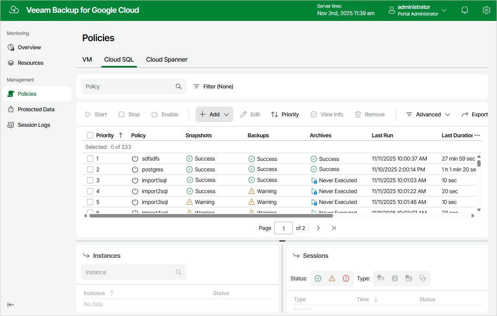

In this article

To launch the Add Cloud SQL Policy wizard, do the following:

1. Navigate to Policies > Cloud SQL.
2. Click Add and select either of the following options:

* MySQL — to create a backup policy that will protect MySQL instances.
* PostgreSQL — to create a backup policy that will protect PostgreSQL instances.

Page updated 11/11/2025

Page content applies to build 7.0.0.47
