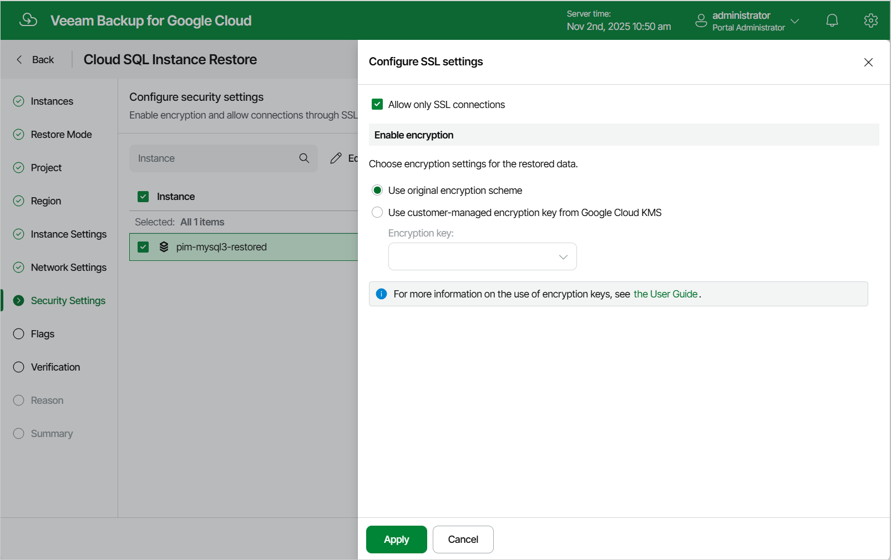

In this article

[This step applies only if you have selected the Restore to new location, or with different settings option at the Restore Mode step of the wizard]

At the Security Settings step of the wizard, do the following:

1. Select the Cloud SQL instance.
2. Click Edit.
3. In the opened window, choose whether you want to connect to the restored Cloud SQL instance using SSL only, and whether you want the instance data to be encrypted with a Google Cloud KMS CMEK:

* If you want to secure connections to the restored Cloud SQL instance, set the Allow only SSL connections toggle to On.

Since SSL connections use digital certificates to provide encrypted access, make sure that you have obtained a Certificate Authority (CA) certificate, a client public key certificate, and a client private key — before you connect to the restored instance using SSL. For more information, see [Google Cloud documentation](https://cloud.google.com/sql/docs/mysql/connect-admin-ip#connect-ssl).

* If you want to apply the existing encryption scheme of the source Cloud SQL instance, select the Use original encryption scheme option.

* If you want to encrypt the restored data with a CMEK, select the Use customer-managed encryption key from Google Cloud KMS option and choose the necessary CMEK from the Encryption key drop-down list.

For a CMEK to be displayed in the list of available encryption keys, it must be stored in the region selected at [step 6](sql_restore_region.md) of the wizard.

|  |
| --- |
| Note |
| Due to technical limitations in Google Cloud, Veeam Backup for Google Cloud does not support data encryption with multi-regional keys. For more information, see [Cloud SQL for MySQL documentation](https://cloud.google.com/sql/docs/mysql/configure-cmek#key) and [Cloud SQL for PostgreSQL documentation](https://cloud.google.com/sql/docs/postgres/configure-cmek#key). |

Page updated 11/4/2025

Page content applies to build 7.0.0.47
