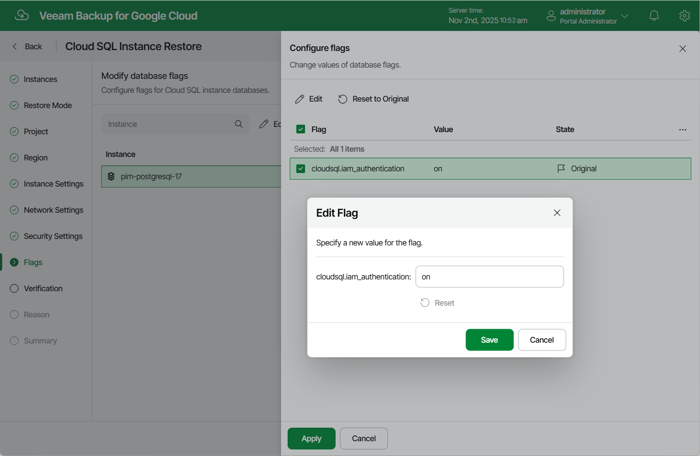

In this article

[This step applies only if you have selected the Restore to new location, or with different settings option at the Restore Mode step of the wizard]

At the Flags step of the wizard, you can instruct Veeam Backup for Google Cloud to modify flags set on databases of the restored Cloud SQL instance:

1. Select the Cloud SQL instance.
2. Click Edit.
3. In the Configure flags window, choose whether you want flags of the restored databases to have the same values as the source databases or new modified values.

If you want to set a new value for a database flag, select the flag and click Edit. If you want to clear all flags to their original values, click Reset to Original. To save changes made to the flag settings, click Apply.

Page updated 11/4/2025

Page content applies to build 7.0.0.47
