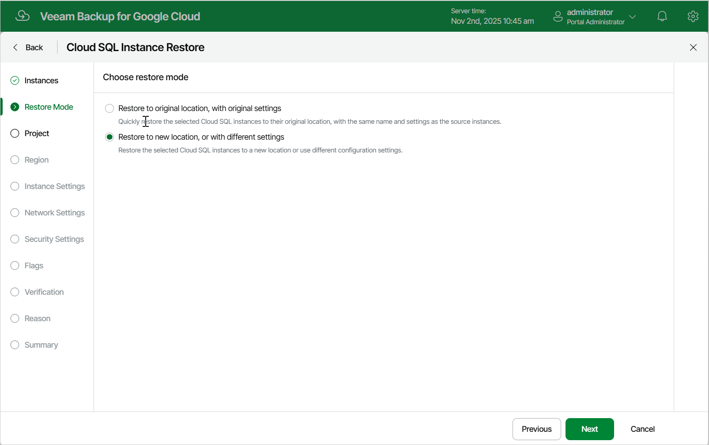

# Step 3. Choose Restore Mode

At the Restore Mode step of the wizard, choose whether you want to restore the selected Cloud SQL instance to the original or to a custom location.

|  |
| --- |
| Important |
| Restore to the original location is supported only using restore points of the Backup and Archive types. If you select a restore point of the Snapshot or Manual Snapshot type at [step 2](sql_restore_point.md) of the wizard, you will be able to select the Restore to original option and proceed with the wizard but only up to the Verification step — at this step, the verification check will notify you that the restore settings have not been configured properly. As a result, Veeam Backup for Google Cloud will not be able to perform the operation |

