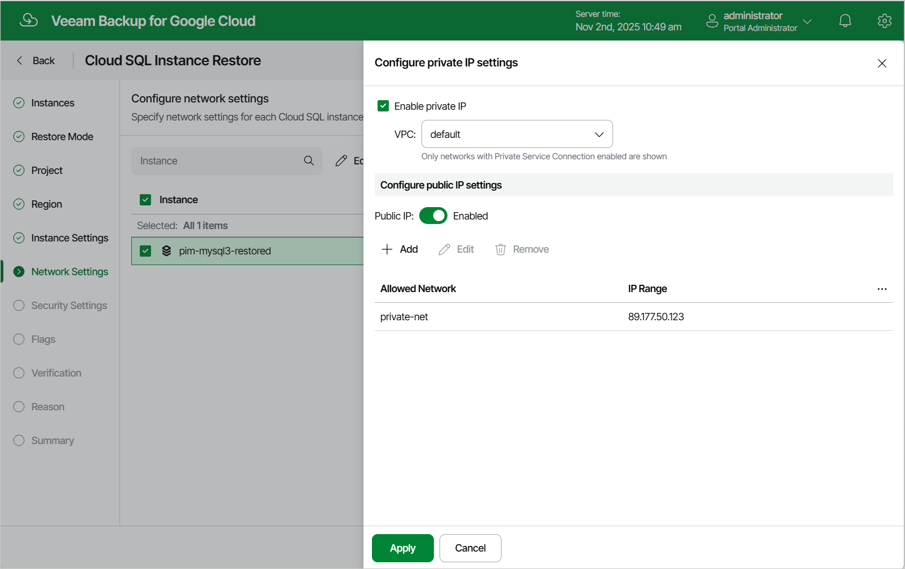

# Step 8. Configure Network Settings

[This step applies only if you have selected the Restore to new location, or with different settings option at the Restore Mode step of the wizard]

At the Network Settings step of the wizard, do the following:

1. Select the Cloud SQL instance.
2. Click Edit.
3. In the Edit network settings window, choose whether you want to configure public IP and private IP connectivity for the restored Cloud SQL instance:

* To connect the restored Cloud SQL instance to a VPC network with a private IP address, select the Private IP check box and specify a VPC network to which the instance will be connected. For a VPC network to be displayed in the lists of available networks, it must contain a subnet that exists in the region specified at [step 6](sql_restore_region.md) of the wizard.

|  |
| --- |
| Important |
| The specified VPC network must have private services access configured. To learn how to configure private services access for a VPC network, see [Google Cloud documentation](https://cloud.google.com/vpc/docs/configure-private-services-access). |

* To assign a public IPv4 address to the restored Cloud SQL instance and to accept connections to it from specific IP address ranges, set the Public IP toggle to On, click Add and then enter the allowed IP address ranges in the Add Network Connection window.

|  |
| --- |
| Tip |
| The IP address ranges must be specified in the CIDR notation (for example, 12.23.34.0/24). To let all IP addresses access the restored Cloud SQL instance, you can enter 0.0.0.0/0. However, note that allowing access from all IP addresses is unsafe and thus not recommended in production environments. |

