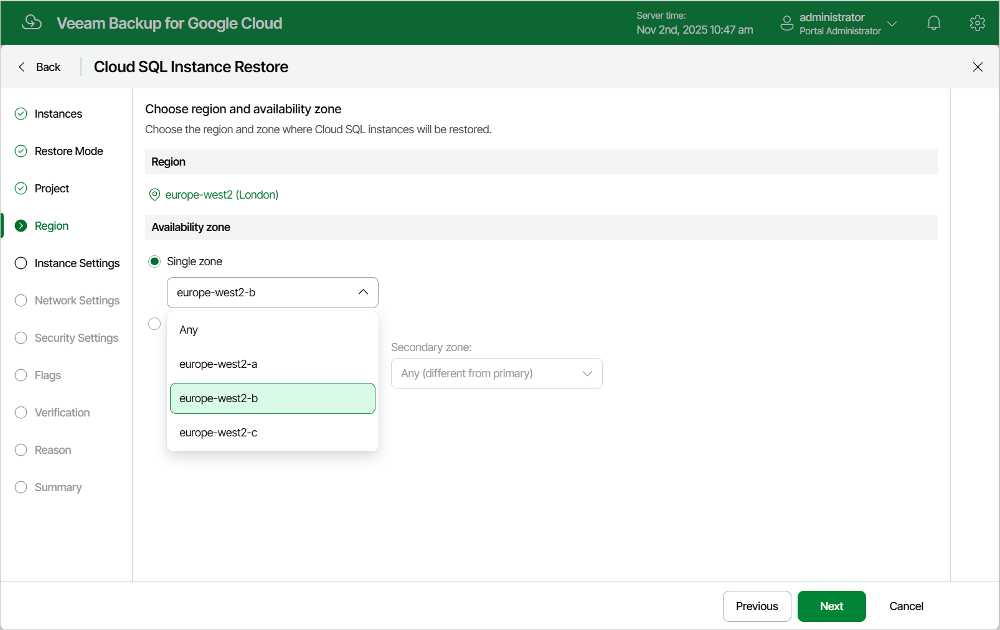

In this article

[This step applies only if you have selected the Restore to new location, or with different settings option at the Restore Mode step of the wizard]

At the Region step of the wizard, select a region where the restored Cloud SQL instance will operate and an availability zone for which you want to configure network settings.

To configure the restored Cloud SQL instance for high availability, select the Multiple zones option, and choose a primary and a secondary zone where the restored Cloud SQL instance will be located within the selected region. The high availability configuration allows you to reduce downtime when a zone or the instance becomes unavailable. For more information on high availability in Google Cloud, see [Google Cloud documentation](https://cloud.google.com/sql/docs/mysql/high-availability).

|  |
| --- |
| Tip |
| If some of the restored Cloud SQL instances cannot be configured for high availability, the wizard will display a message notifying that the instances have issues with the original zone settings. To learn what these issues are, click the instance link in the message. |

Page updated 11/4/2025

Page content applies to build 7.0.0.47
