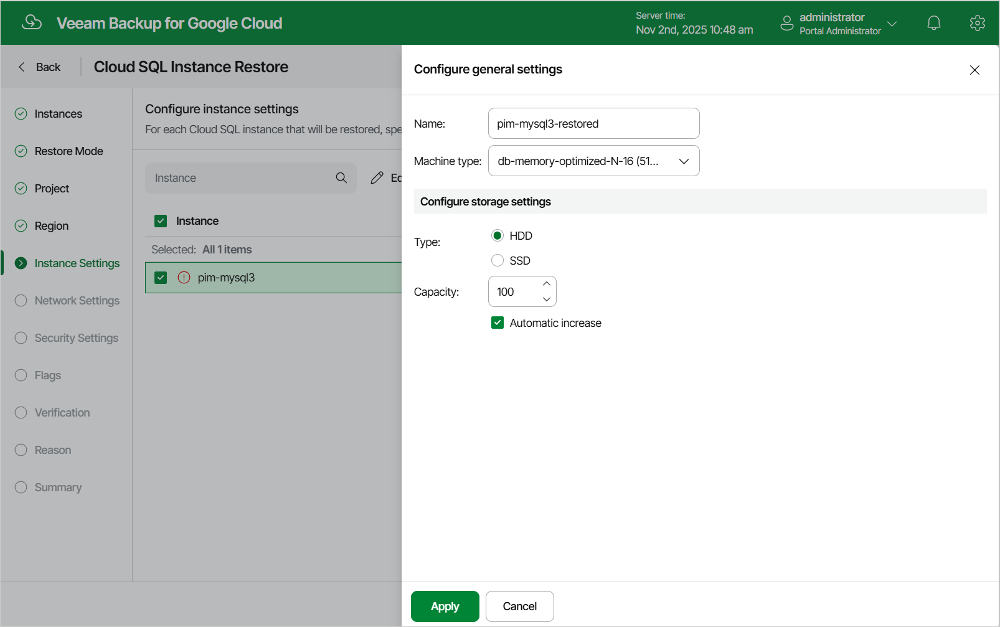

# Step 7. Specify Instance Name and Type

[This step applies only if you have selected the Restore to new location, or with different settings option at the Restore Mode step of the wizard]

At the Instance Settings step of the wizard, do the following:

1. Select the Cloud SQL instance.
2. If you want to specify a new name and a new machine type for the restored Cloud SQL instance, or to configure storage settings for the instance, click Edit.

In the Configure general settings window, specify the name and the machine type, and click Apply. To learn how to choose a machine type when creating a Cloud SQL instance in Google Cloud, see [Google Cloud documentation](https://cloud.google.com/sql/docs/mysql/instance-settings#machine-type-2ndgen).

|  |
| --- |
| Note |
| Restore of PostgreSQL instances to Cloud SQL instances of the db-f1-micro and db-g1-small machine types is not supported. If you want to restore a PostgreSQL instance to one of the specified machine types, you must first manually create a Cloud SQL instance of the necessary type in the Google Cloud console as described in [Google Cloud documentation](https://cloud.google.com/sql/docs/postgres/create-instance), and then restore the backed-up databases to the created instance as described in section [Performing Database Restore](performing_database_restore_ui.md). |

You can also choose a new storage type and manually increase storage capacity for the restored Cloud SQL instance. If you want Veeam Backup for Google Cloud to increase the storage capacity to fit the instance size automatically, select the Automatic increase check box. Note, however, that the amount of storage capacity allocated to an instance affects its cost. To learn how to configure storage settings when creating a Cloud SQL instance in Google Cloud, see [Google Cloud documentation](https://cloud.google.com/sql/docs/mysql/instance-settings#storage-type-2ndgen).

|  |
| --- |
| Tip |
| If Veeam Backup for Google Cloud is unable to restore the Cloud SQL instance using the specified name for some reason, the wizard will display an error icon in the Instance column. To learn what this reason is, hover your mouse over the icon. |

