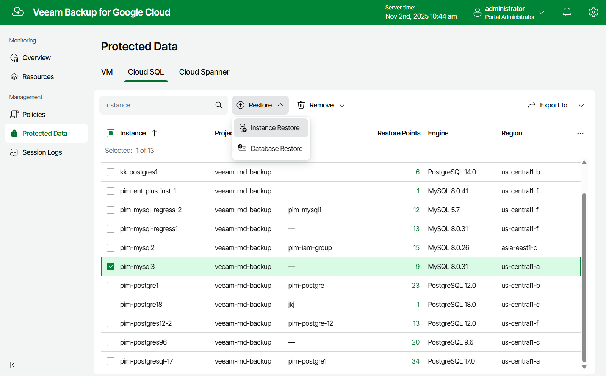

In this article

To launch the Cloud SQL Instance Restore wizard, do the following:

1. Navigate to Protected Data > Cloud SQL.
2. Select the Cloud SQL instance that you want to restore, and click Restore > Instance Restore.

Page updated 11/4/2025

Page content applies to build 7.0.0.47
