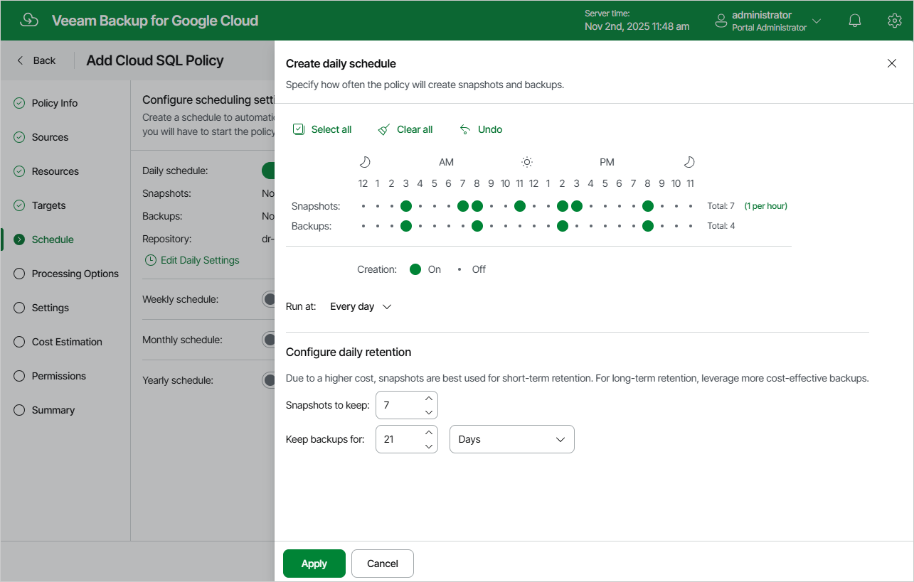

In this article

To create a daily schedule for the backup policy, at the Schedule step of the wizard, do the following:

1. Set the Daily schedule toggle to On and click Edit Daily Settings.
2. In the Create daily schedule section, select hours when the backup policy will create cloud-native snapshots and image-level backups. Use the Run at drop-down list to choose whether you want the backup policy to run every day, on weekdays (Monday through Friday) or on specific days.

If you want to protect Cloud SQL instance data more frequently, you can instruct the backup policy to create multiple cloud-native snapshots per hour. To do that, click the link to the right of the Snapshots hour selection area, and specify the number of cloud-native snapshots that the backup policy will create within an hour.

|  |
| --- |
| Note |
| Veeam Backup for Google Cloud does not create image-level backups independently from cloud-native snapshots. That is why when you select hours for image-level backups, the same hours are automatically selected for cloud-native snapshots. To learn how Veeam Backup for Google Cloud performs backup, see [How Backup Works](backup_sql.md). |

1. In the Configure daily retention section, configure retention policy settings for the daily schedule:

* For cloud-native snapshots, specify the number of restore points that you want to keep in a snapshot chain.

If the restore point limit is exceeded, Veeam Backup for Google Cloud removes the earliest restore point from the chain. For more information, see [Retention Policy for Snapshots](snapshot_retention_sql.md).

|  |
| --- |
| Important |
| Snapshots of Cloud SQL instances are taken using [native Google Cloud capabilities](https://cloud.google.com/sql/docs/mysql/backup-recovery/backups), and therefore, if you delete a Cloud SQL instance from Google Cloud, all cloud-native snapshots created by the backup policy for the removed instance will be automatically deleted from Google Cloud Storage as well, despite the retention settings configured at the Schedule step of the wizard. |

* For image-level backups, specify the number of days (or months) for which you want to keep restore points in a backup chain.

If a restore point is older than the specified time limit, Veeam Backup for Google Cloud removes the restore point from the chain. For more information, see [Retention Policy for Backups](backup_retention_sql.md).

1. To save changes made to the backup policy settings, click Apply.

Page updated 11/11/2025

Page content applies to build 7.0.0.47
