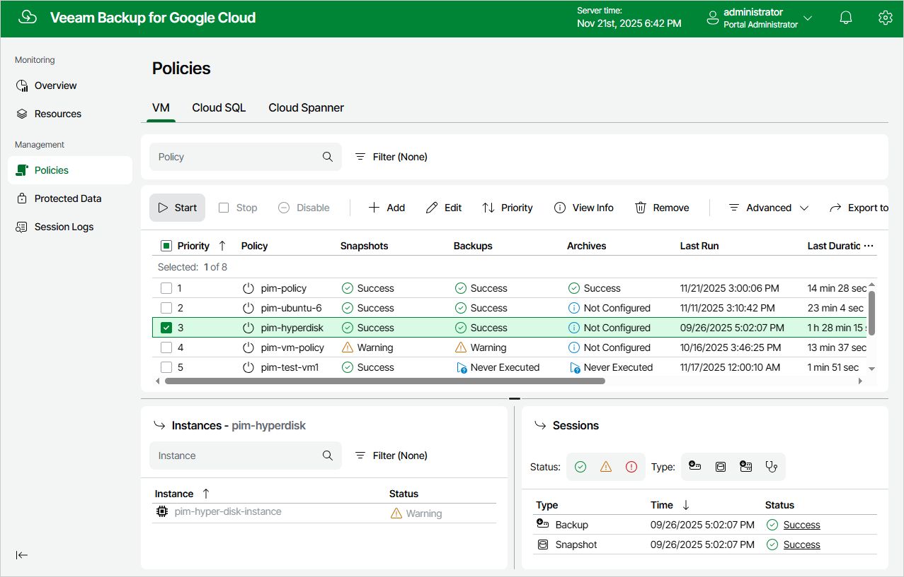

# Starting and Stopping Backup Policies

You can start a backup policy manually, for example, if you want to create an additional restore point in the snapshot or backup chain and do not want to modify the configured backup policy schedule. You can also stop a backup policy if processing of an instance is about to take too long, and you do not want the policy to have an impact on the production environment during business hours.

To start or stop a backup policy, do the following:

1. Navigate to Policies.
2. Switch to the necessary tab and select the backup policy.
3. Click Start or Stop.

