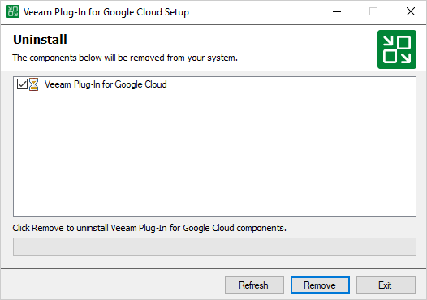

# Uninstalling Plug-In

Before you uninstall Veeam Plug-in for Google Cloud, it is recommended that you [remove all connected backup appliances](removing_appliances.md) from the backup infrastructure. If you keep the appliances in the backup infrastructure, the following will happen:

* You will be able to see information on snapshots of VM instances, Cloud SQL instances and Cloud Spanner Instances in the Veeam Backup & Replication console. However, you will not be able to perform any operations with these snapshots.
* You will be able to see information on image-level backups of Cloud SQL instances in the Veeam Backup & Replication console. However, you will not be able to perform any operations with these backups.
* You will be able to see information on image-level backups of VM instances and perform data recovery operations using these backups. However, restore of entire VM instances to Google Cloud will start working as described in the Veeam Backup & Replication User Guide, section [How Restore to Google Compute Engine Works](https://helpcenter.veeam.com/docs/vbr/userguide/restore_google_hiw.html?ver=13).
* You will be able to see information on image-level backups of Cloud Spanner instances in the Veeam Backup & Replication console. However, you will not be able to perform any operations with these backups.
* You will be able to see information on backup policies. However, you will only be able to remove these policies from the Veeam Backup & Replication console.

To uninstall Veeam Plug-in for Google Cloud, do the following:

1. Log in to the backup server using an account with the local Administrator permissions.
2. Open the Start menu, navigate to Control Panel > Programs > Programs and Features.
3. In the program list, click Veeam Plug-in for Google Cloud and click Uninstall.
4. In the opened window, click Remove.

|  |
| --- |
| Note |
| After you uninstall Veeam Plug-in for Google Cloud, you will be no longer able to add backup appliances and cloud repositories to the backup infrastructure. |

