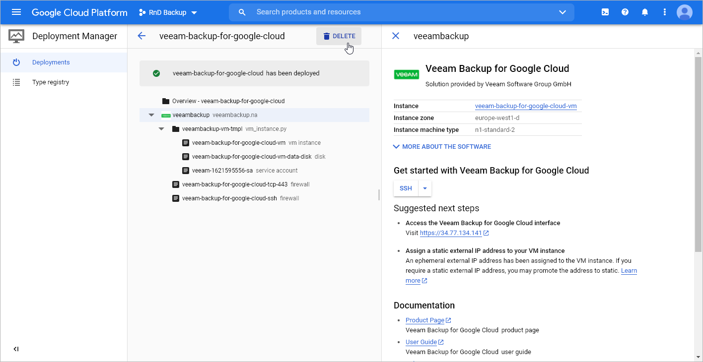
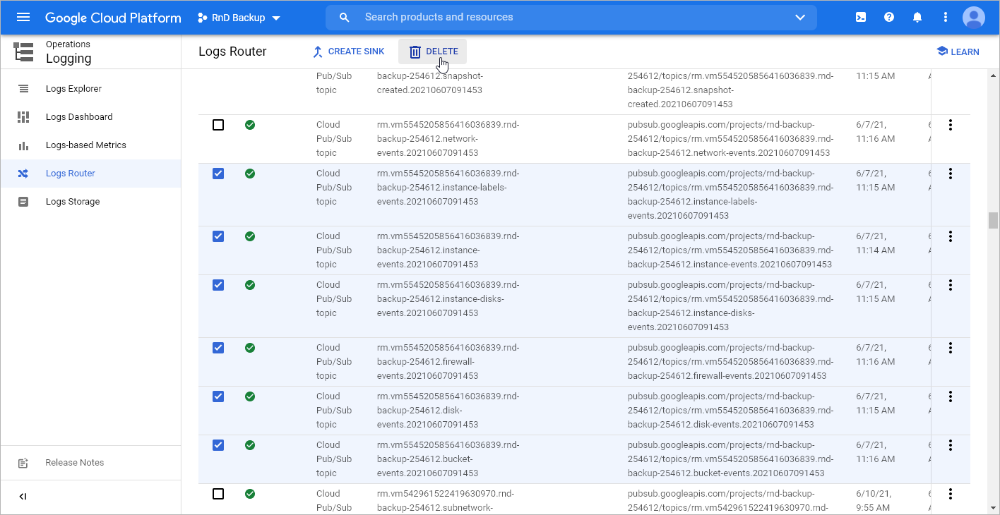
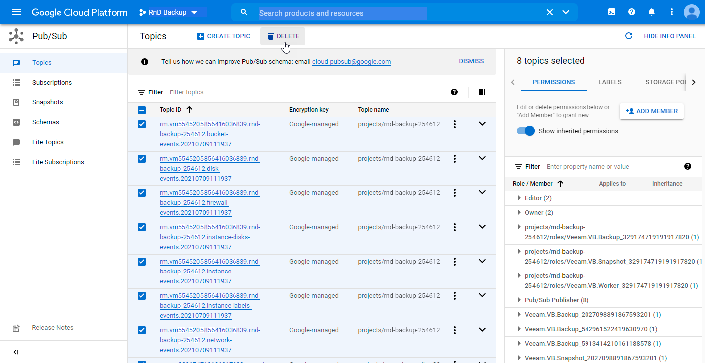

In this article

Veeam Backup for Google Cloud creates a number of resources while operating in Google Cloud, and these resources are not removed from Google Cloud automatically when you uninstall the solution. That is why you must perform the following steps to uninstall Veeam Backup for Google Cloud:

1. Locate and save the unique numeric identifier of the VM instance running Veeam Backup for Google Cloud — you will need it later.

To obtain the ID, you can either look it up on the Instances page in the Google Cloud console, or send a query to the metadata server API using the gcloud command-line tool. To learn how to retrieve instance metadata, see [Google Cloud documentation](https://cloud.google.com/sdk/gcloud/reference/compute/instances/describe).

1. Save the names of Google Cloud projects that have ever been added to Veeam Backup for Google Cloud — you will need it later.

To obtain the names, you can look them up on the Infrastructure > Projects and Folders tab in the Veeam Backup for Google Cloud UI.

1. Log in to [Google Cloud Marketplace](https://cloud.google.com/marketplace) using credentials of the Google account that you used to install Veeam Backup for Google Cloud.
2. Navigate to Your products.
3. Click Veeam Backup for Google Cloud to open the product overview page.
4. Click Delete.

1. Wait until Veeam Backup for Google Cloud is removed from your organization domain.
2. Navigate to IAM & Admins > IAM.

In the list of permissions, locate the deleted:serviceAccount:veeam member, and then unassign all existing roles from this member.

1. Navigate to IAM & Admins > Roles.

In the list of roles, locate the role either with the name that starts with Veeam.VB.\* (for Veeam Backup for Google Cloud version 4.0 or later) or with the name that contains the ID of the VM instance that was running Veeam Backup for Google Cloud (for the previous versions), and then delete this role.

|  |
| --- |
| Note |
| It may take up to one week for the role to be deleted. |

1. Navigate to Logging > Logs Router.

In the list of logs router sinks, locate all sinks with the Cloud Pub/Sub topic type created by Veeam Backup for Google Cloud (the names of these sinks will contain the ID of the VM instance that was running Veeam Backup for Google Cloud), and then delete these sinks.

1. Navigate to Pub/Sub > Subscriptions.

In the list of subscriptions, locate all subscriptions created by Veeam Backup for Google Cloud (the names of these subscriptions will contain the ID of the VM instance that was running Veeam Backup for Google Cloud), and then delete these subscriptions.

1. Navigate to Pub/Sub > Topics.

In the list of topics, locate all topics created by Veeam Backup for Google Cloud (the names of these topics will contain the ID of the VM instance that was running Veeam Backup for Google Cloud), and then delete these topics.

1. Repeat steps 8–12 for each project that has ever been added to Veeam Backup for Google Cloud.

Page updated 10/2/2024

Page content applies to build 7.0.0.47
