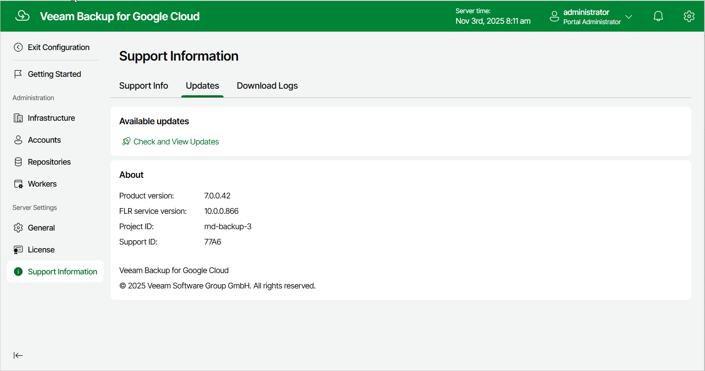
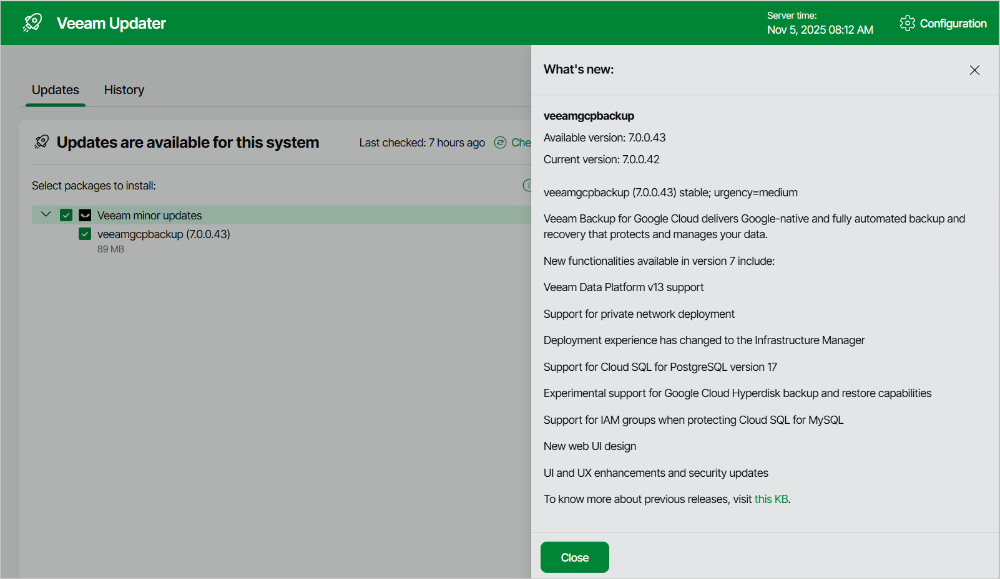

# Checking for Updates

Veeam Backup for Google Cloud automatically notifies you about newly released product versions and package updates available for the operating system running on the backup appliance. However, you can check for the available updates manually if required:

1. Switch to the Configuration page.
2. Navigate to Support Information > Updates.
3. Click Check and View Updates.

If new updates are available, Veeam Backup for Google Cloud will display them on the Updates tab of the Veeam Updater page. To view detailed information on an update, select the check box next to the update and click What's new?

Related Topics

* [Installing Updates](updates_install.md)
* [Viewing Updates History](updates_history.md)

