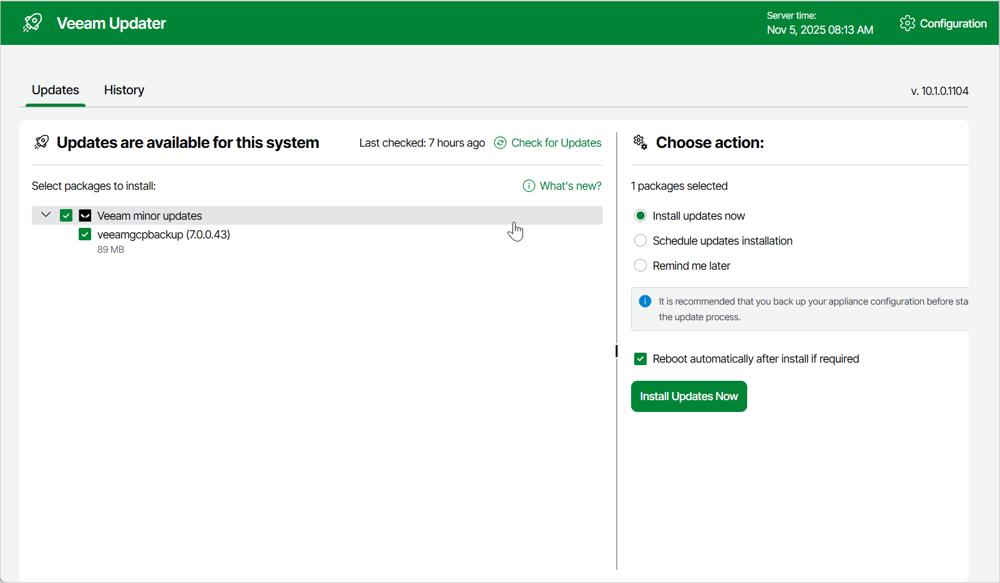
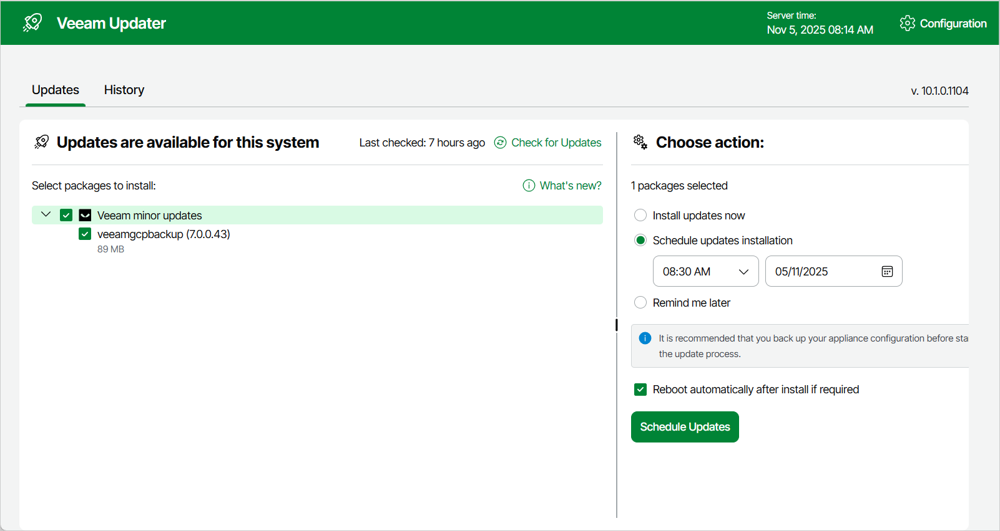
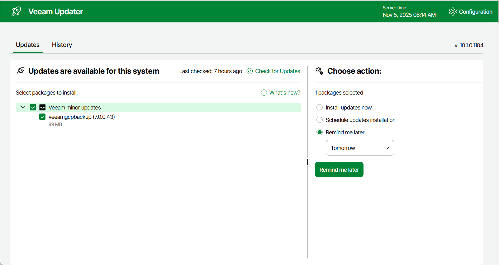

# Installing Updates

To download and install new available package updates, you can use either of the following options:

* [Install updates immediately](#install)
* [Schedule update installation](#schedule)

You can also [set a reminder to send update notifications](#reminder).

|  |
| --- |
| Important |
| * You can update the standalone backup appliance using the Veeam Updater service only. Updating the standalone appliance manually is not supported. * You can update the backup appliance managed by a Veeam Backup & Replication server from the Veeam Backup & Replication console only, as described in section [Upgrading Appliances Using Console](appliance_upgrade_console.md). Updating the managed appliance using the Veeam Updater service is not supported. |

Installing Updates

|  |
| --- |
| Important |
| Before you install a product update, make sure that all backup policies are stopped and no restore tasks are currently executing. Otherwise, the update process will interrupt the running activities, which may result in data loss. |

To download and install available product and package updates:

1. Open the Veeam Updater page. To do that:

1. Switch to the Configuration page.
2. Navigate to Support Information.
3. On the Updates tab, click Check and View Updates.

1. On the Veeam Updater page, do the following:

1. In the Updates are available for this system section, select check boxes next to the necessary updates.
2. In the Choose action section, select the Install updates now option, select the Reboot automatically after install if required check box to allow Veeam Backup for Google Cloud to reboot the backup appliance if needed, and then click Install Updates Now.

|  |
| --- |
| Note |
| The updater may require you to read and accept the Veeam license agreement and the 3rd party components license agreement. If you reject the agreements, you will not be able to continue installation. |

Veeam Backup for Google Cloud will download and install the updates; the results of the installation process will be displayed on the [History tab](updates_history_old.md). Keep in mind that it may take several minutes for the installation process to complete.

|  |
| --- |
| Note |
| When installing product updates, Veeam Backup for Google Cloud restarts all services running on the backup appliance, including the Web UI service. That is why Veeam Backup for Google Cloud will log you out when the update process completes. |

Scheduling Update Installation

You can instruct Veeam Backup for Google Cloud to automatically download and install available product versions and package updates on a specific date at a specific time:

1. On the Veeam Updater page, in the Updates are available for this system section, select check boxes next to the necessary updates.
2. In the Choose action section, do the following:

1. Select the Schedule updates installation option and configure the necessary schedule.

|  |
| --- |
| Important |
| When selecting a date and time for the update installation, make sure that no backup policies are scheduled to run on the selected time. Otherwise, the update process will interrupt the running activities, which may result in data loss. |

1. Select the Reboot automatically after install if required check box to allow Veeam Backup for Google Cloud to reboot the backup appliance if needed.
2. Click Schedule Updates.

Veeam Backup for Google Cloud will automatically download and install the updates on the selected date at the selected time; the results of the installation process will be displayed on the [History tab](updates_history_old.md).

Setting Update Reminder

If you have not decided when to install available updates, you can set an update reminder — instruct Veeam Backup for Google Cloud to send an update notification later.

To do that, on the Veeam Updater page, in the Choose action section, do the following:

1. Select the Remind me later option and choose when you want to receive the reminder.

If you select the Next Week option, Veeam Backup for Google Cloud will send the reminder on the following Monday.

1. Click Remind me later.

