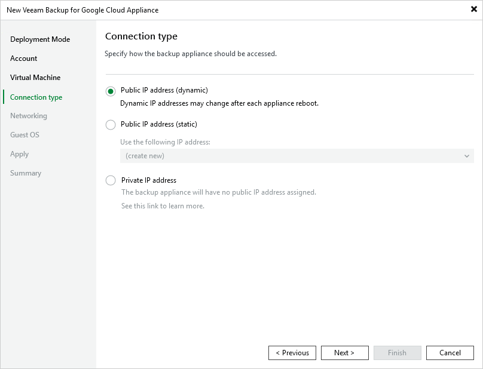

In this article

At the Connection Type step of the wizard, choose whether you want to assign a dynamic or a static public IP address to the backup appliance, or use only a private IP address. After the backup appliance is deployed, Veeam Backup & Replication will use the specified connection type to connect to the appliance.

To assign a static IP address, you can either reserve a new address or specify an existing one:

* To reserve a new IP address, select the (create new) option from the Use the following address drop-down list.

* To assign an existing IP address, select it from the Use the following IP address drop-down list. For an IP address to be displayed in the list of available static IP addresses, it must be reserved in Google Cloud as described in [Google Cloud documentation](https://cloud.google.com/compute/docs/ip-addresses/reserve-static-external-ip-address).

|  |
| --- |
| NoteS |
| * You can use only IPv4 regional IP address as static external IP addresses for backup appliances. * If you choose the Private IP address option, you must [allow communication](ports.md) between the Veeam Backup & Replication server and the backup appliance . |

Page updated 12/9/2025

Page content applies to build 7.0.0.47
