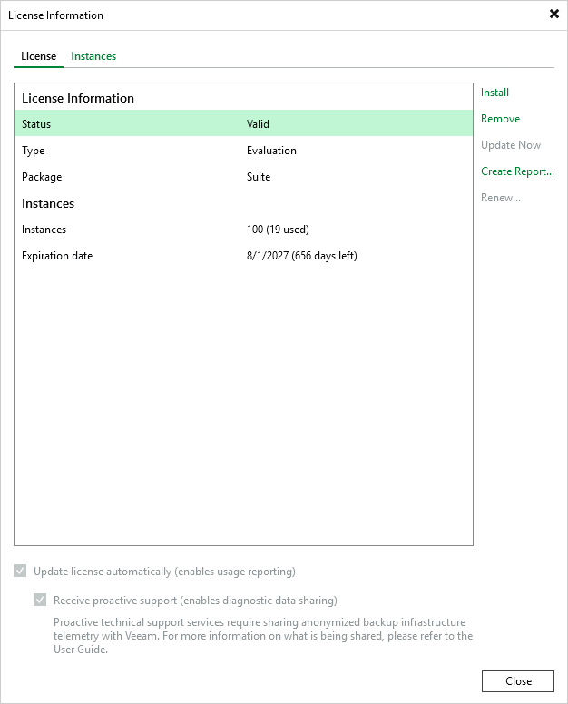
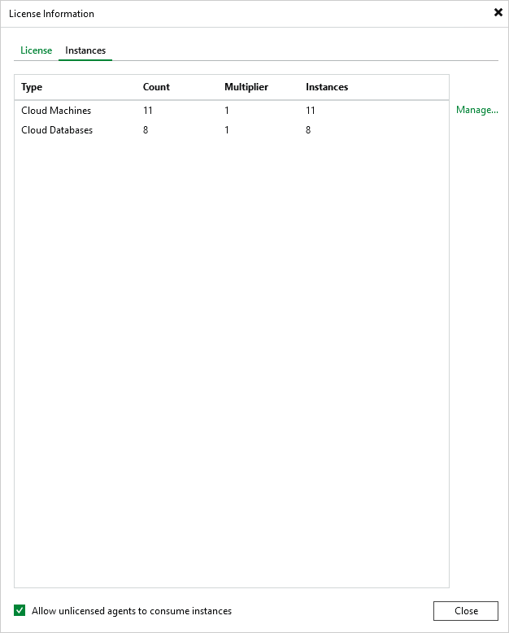
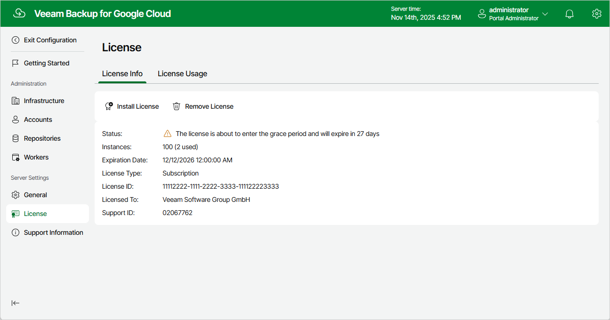

In this article

After you add a backup appliance to the backup infrastructure, you can view the number of protected workloads in the Veeam Backup & Replication console.

Viewing License Details Using Veeam Backup & Replication Console

To view Veeam Plug-in for Google Cloud license details in the Veeam Backup & Replication console, open the main menu and select License.

The License tab of the License Information window provides general information on the currently installed Veeam Plug-in for Google Cloud license:

* Status — the license status. The status will depend on the license type, the number of days remaining until license expiration, the number of days remaining in the grace period (if any), and the number of workloads that exceeded the allowed increase limit (if any).
* Type — the license type (Perpetual, Subscription, Rental, Evaluation, NFR, Free).
* Edition — the license edition (Community, Standard, Enterprise, Enterprise Plus).
* Support ID — the ID of the contract (required for contacting Veeam Customer Support).
* Licensed to — the name of an organization to which the license was issued.
* Package — the software product for which the license was issued.
* Instances — the total number of license units included in the license file and the number of units consumed by protected workloads.
* Support expiration date — the date when the license will expire.

The Instances tab of the License Information window provides information on the currently protected workloads:

* Type — the type of protected instances.

* Virtual Machines — protected VM instances.
* Cloud VMs — protected VM instances.
* Cloud Databases — protected Cloud SQL and Cloud Spanner instances.

* Count — the number of protected instances.
* Multiplier — the number of license units that one protected instance consumes.
* Instances — the total number of the consumed license units.

Viewing License Details Using Veeam Backup for Google Cloud Web UI

To view details on the license that is currently installed on the backup appliance in the Veeam Backup for Google Cloud Web UI, do the following:

1. Switch to the Configuration page.
2. Navigate to License > License Info.

The License Info tab provides general information on the Veeam Backup for Google Cloud license:

* Status — the license status. The status depends on the license edition, the number of days remaining until license expiration and the number of days remaining in the grace period (if any).
* Instances — the total number of license units included in the license file and the number of units consumed by protected instances.

Each instance that has a restore point created in the past 31 days is considered to be protected and consumes one license unit. To view the list of instances that consume license units, switch to the License Usage tab.

* Expiration Date — the date when the license will expire.
* License Type — the license edition (Free, Subscription).

|  |
| --- |
| Note |
| Subscription is the name of the Paid license in Veeam Backup for Google Cloud. |

* License ID — the unique identification number of the provided license file (required for contacting the Veeam Customer Support Team).
* Licensed To — the name of an organization to which the license was issued.
* Support ID — the unique identification number of the support contract (required for contacting the Veeam Customer Support Team).

Related Topics

* [Installing and Removing License](installing_license.md)
* [Getting Technical Support](collecting_logs.md)

Page updated 11/14/2025

Page content applies to build 7.0.0.47
