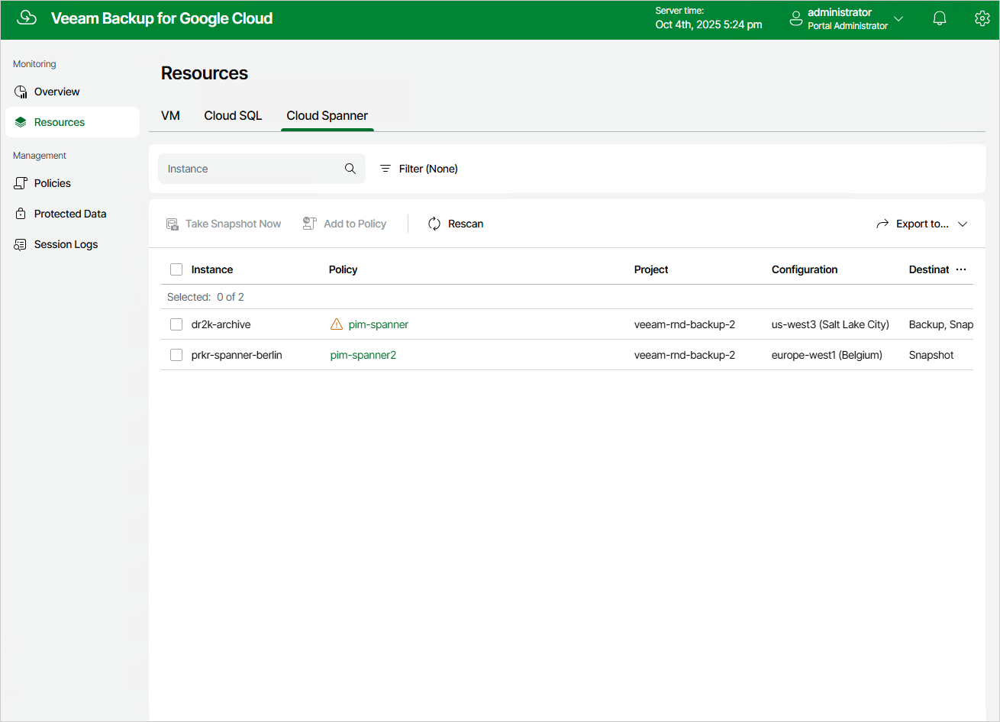

# Viewing Available Resources

After you create a backup policy to protect a specific type of Google Cloud resources (VM instances, Cloud SQL instances or Cloud Spanner instances), Veeam Backup for Google Cloud rescans Google Cloud regions specified in the policy settings and populates the resource list on the Resources page with all resources of that type residing in these regions. If a region is no longer specified in any backup policy, Veeam Backup for Google Cloud removes all resources residing in the region from the list of available resources.

The Resources page displays Google Cloud resources that can be protected by Veeam Backup for Google Cloud. Each resource is represented with a set of properties, such as:

* Instance — the name of the resource.
* Policy — the name of the backup policy that protects the resource (if any).
* Region — the region in which the resource resides.
* Project — the project that manages the resource.
* Restore Points — the number of restore points created for the resource (if any).
* Latest Restore Point — the date and time of the most recent restore point created for the resource (if any).
* Destination — the type of restore points created for the resource (if any).

On the Resources page, you can also perform the following actions:

* Manually create cloud-native snapshots of VM, Cloud SQL and Cloud Spanner instances. For more information, see sections [Performing VM Backup](creating_manual_snapshots_vms.md), [Performing SQL Backup](creating_manual_snapshots_sql.md) and [Performing Spanner Backup](creating_manual_snapshots_spanner.md).
* Add VM, Cloud SQL and Cloud Spanner instances to the existing backup policies. For more information, see [Adding Resources to Policies](adding_resources_to_policies.md).

