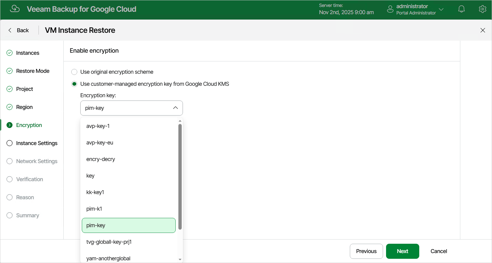

In this article

[This step applies only if you have selected the Restore to new location, or with different settings option at the Restore Mode step of the wizard]

At the Encryption step of the wizard, do the following:

* If you want to apply the existing encryption scheme of the source VM instance, select the Use original encryption scheme option.
* If you want to encrypt persistent disks of the restored VM instance with a Google Cloud KMS CMEK, select the Use customer-managed encryption key from Google Cloud KMS option and choose the necessary CMEK from the Encryption key drop-down list.

For a CMEK to be displayed in the list of available encryption keys, it must be stored in the region selected at [step 6](vm_restore_region.md) of the wizard.

Page updated 11/4/2025

Page content applies to build 7.0.0.47
