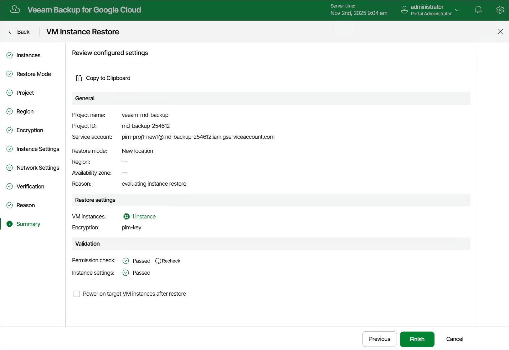

In this article

At the Summary step of the wizard, review summary information and click Finish.

|  |
| --- |
| Tip |
| If you want to keep the restored VM instance running as soon as the restore process completes, select the Power on target VM instances after restore check box. Otherwise, the instance will be powered off. |

Page updated 11/4/2025

Page content applies to build 7.0.0.47
