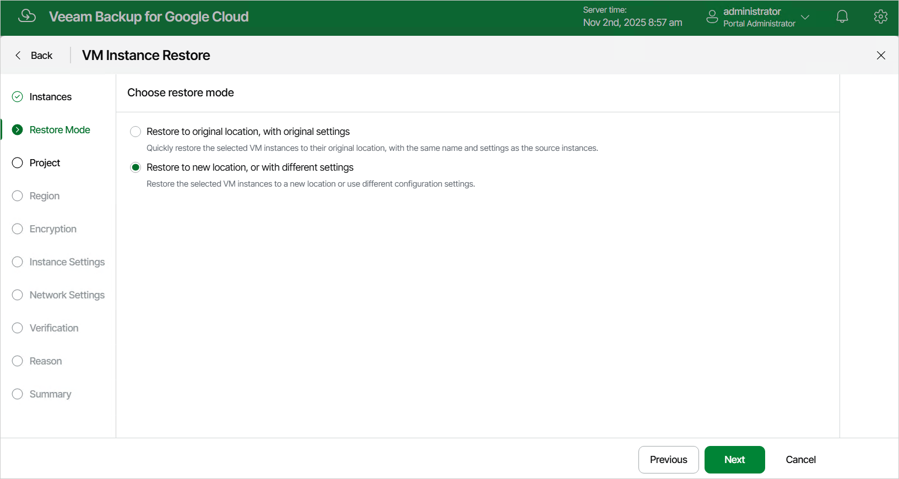

In this article

At the Restore Mode step of the wizard, choose whether you want to restore the selected VM instance to the original or to a custom location.

|  |
| --- |
| Tip |
| If restore to the original location is not available, the wizard will display a message notifying that some of the selected VM instances have issues with the original settings. To learn what these issues are, hover the mouse cursor over the message. |

Page updated 11/4/2025

Page content applies to build 7.0.0.47
