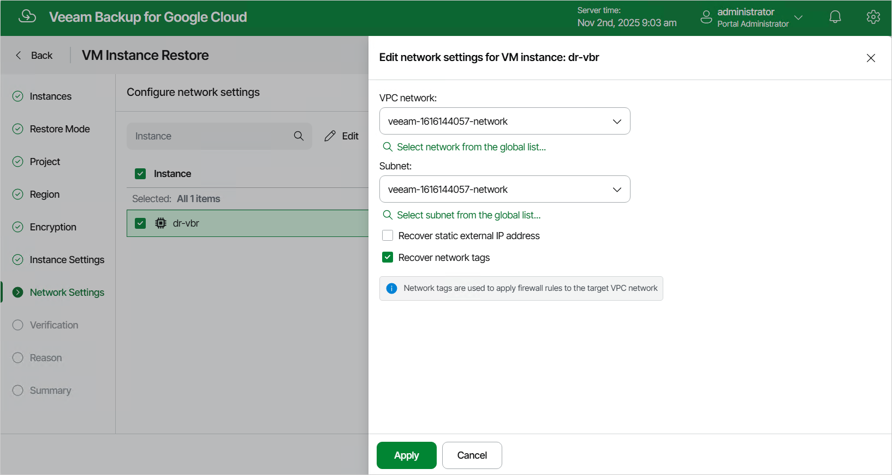

In this article

[This step applies only if you have selected the Restore to new location, or with different settings option at the Restore Mode step of the wizard]

At the Network Settings step of the wizard, do the following:

1. Select the VM instance.
2. Click Edit.
3. In the Edit network settings window, select a VPC network and a subnet to which the restored VM instance will be connected. You can also choose whether you want the restored VM instance to have the same reserved static external IP address and the same network tags as the source VM instance.

For a VPC network and a subnet to be displayed in the lists of available networks, they must be created in the Google Cloud console for the region specified at [step 6](vm_restore_region.md) of the wizard, as described in [Google Cloud documentation](https://cloud.google.com/vpc/docs/using-vpc).

|  |
| --- |
| Note |
| Veeam Backup for Google Cloud cannot assign a static external IP address to a restored VM instance if the source instance does not have the address reserved. To learn how to reserve static external IP addresses for VM instances, see [Google Cloud documentation](https://cloud.google.com/compute/docs/ip-addresses/reserve-static-external-ip-address). |

Page updated 11/4/2025

Page content applies to build 7.0.0.47
