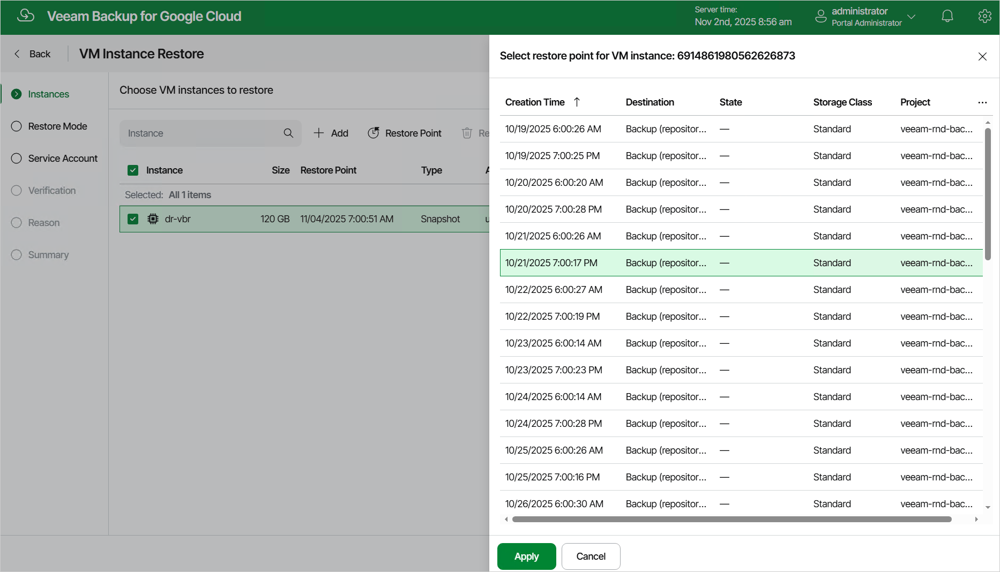

In this article

At the Instances step of the wizard, select a restore point that will be used to restore the selected VM instance. By default, Veeam Backup for Google Cloud uses the most recent valid restore point. However, you can restore the VM instance data to an earlier state.

To select a restore point, do the following:

1. Select the VM instance and click Restore Point.
2. In the Select restore point window, select the necessary restore point and click Apply.

To help you choose a restore point, Veeam Backup for Google Cloud provides the following information on each available restore point:

* Creation Time — the date when the restore point was created.
* Destination — the type of the restore point:

* Snapshot — a cloud-native snapshot created by a backup policy.
* Manual Snapshot — a cloud-native snapshot created manually.
* Backup — an image-level backup created by a backup policy.

* State — the result of the latest health check performed for the restore point.

* Storage Class — the storage class of a backup repository where the restore point is stored (applies only to image-level backups).
* Project — a project that manages the protected VM instance.
* Region — a region in which the protected VM instance resides.
* Retention — a retention configured for the backup policy that created the restore point.

|  |
| --- |
| Note |
| You cannot restore entire VM instances using restore points in the Incomplete state. You can try running [disk restore](performing_disk_restore.md) instead; however, the operation may fail to complete successfully. |

Page updated 11/4/2025

Page content applies to build 7.0.0.47
