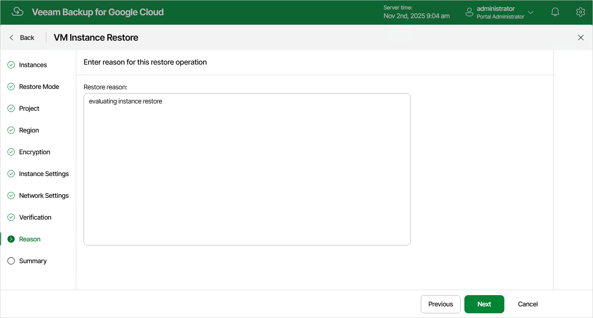

# Step 11. Specify Restore Reason

At the Reason step of the wizard, specify a reason for restoring the VM instance. This information will be saved to the session history, and you will be able to reference it later.

