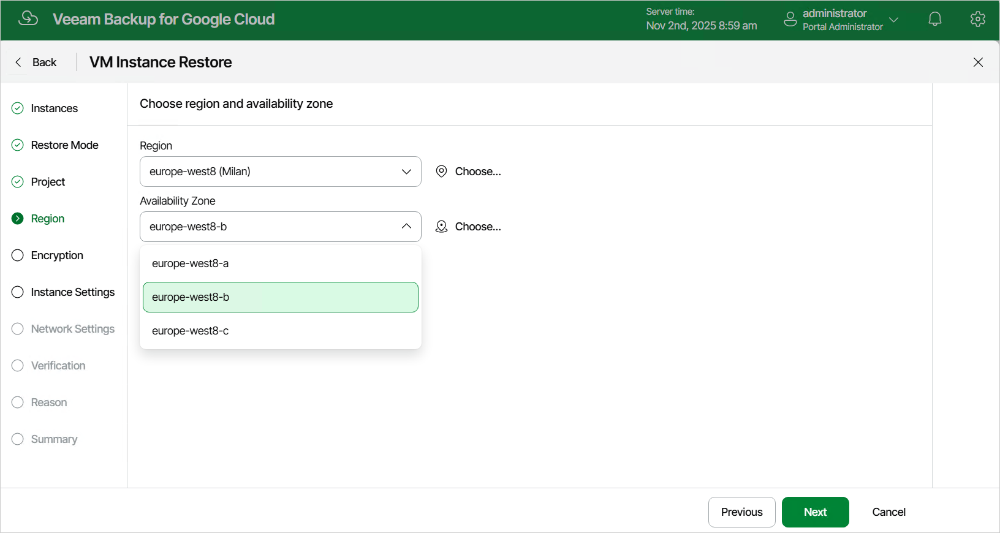

In this article

[This step applies only if you have selected the Restore to new location, or with different settings option at the Restore Mode step of the wizard]

At the Region step of the wizard, select a region where the restored VM instance will operate and an availability zone for which you want to configure network settings.

Page updated 11/4/2025

Page content applies to build 7.0.0.47
