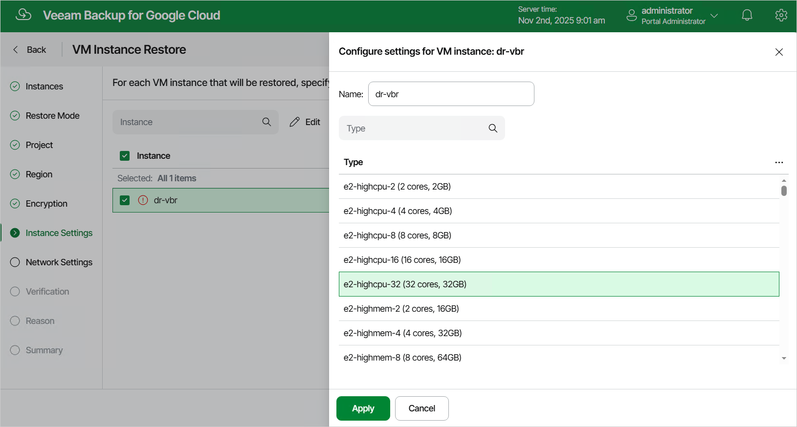

In this article

[This step applies only if you have selected the Restore to new location, or with different settings option at the Restore Mode step of the wizard]

At the Instance Settings step of the wizard, do the following:

1. Select the VM instance.
2. If you want to specify a new name and a new machine type for the restored VM instance, click Edit.

In the Configure settings window, specify the name and the machine type, and click Apply. To learn how to choose a machine type when creating a VM instance in Google Cloud, see [Google Cloud documentation](https://cloud.google.com/compute/docs/machine-types).

|  |
| --- |
| Tip |
| If Veeam Backup for Google Cloud is unable to restore the VM instance using the specified name for some reason, the wizard will display an error icon in the Instance column. To learn what this reason is, hover your mouse over the icon. |

Page updated 11/4/2025

Page content applies to build 7.0.0.47
