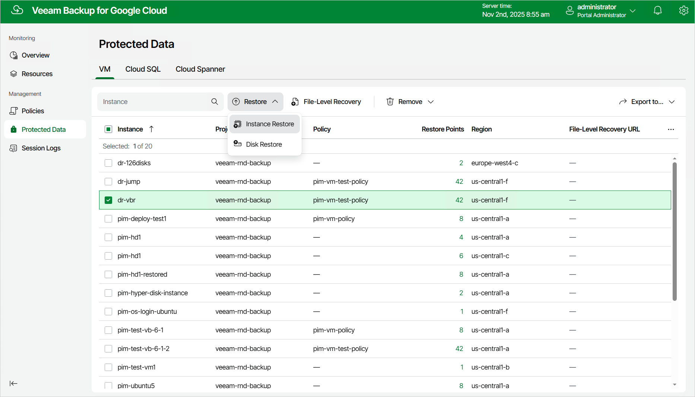

In this article

To launch the VM Instance Restore wizard, do the following:

1. Navigate to Protected Data > VM.
2. Select the VM instance that you want to restore, and click Restore > Instance Restore.

Page updated 11/4/2025

Page content applies to build 7.0.0.47
