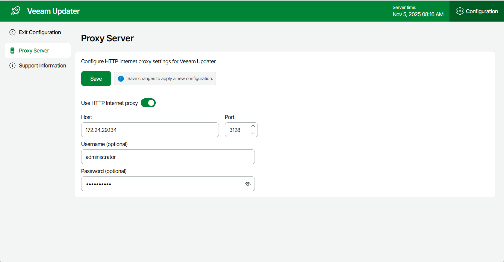

In this article

To check for available package updates for Veeam Backup for Google Cloud, the Veeam Updater service running on the backup appliance connects to Veeam repositories over the internet. If the backup appliance is not connected to the internet, you can instruct the Veeam Updater service to use a web proxy that will provide access to the required resources.

To configure connection to the internet through a web proxy, do the following:

1. Open the Veeam Updater page. To do that:

1. Switch to the Configuration page.
2. Navigate to Support Information.
3. On the Updates tab, click Check and View Updates.

1. On the Veeam Updater page:

1. Switch to the Configuration page and do the following:
2. Navigate to Proxy Server.
3. Set the Use Internet proxy toggle to On.
4. In the Host field, enter the IP address or FQDN of the web proxy.
5. In the Port field, enter the port used on the web proxy for HTTP or HTTPS connections.
6. [Applies only if the web proxy requires authentication] In the Username and Password fields, enter credentials of the user account configured on the web proxy to access the internet.
7. Click Save.

Page updated 11/14/2025

Page content applies to build 7.0.0.47
