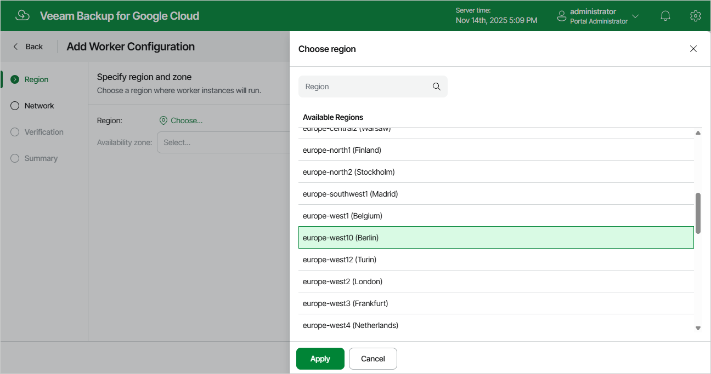

In this article

At the Region step of the wizard, select a region where new worker instances will operate and an availability zone for which you want to configure network settings.

Page updated 11/14/2025

Page content applies to build 7.0.0.47
