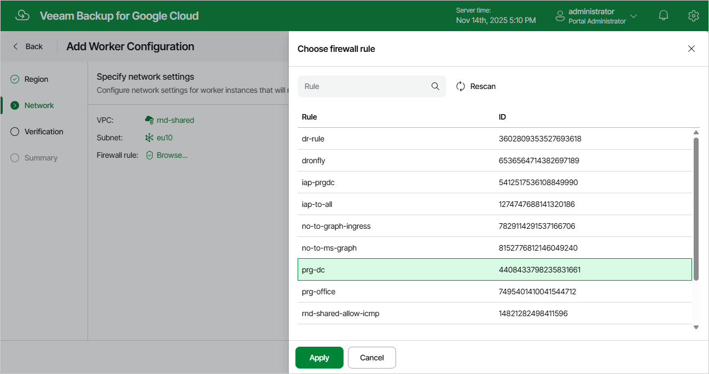

In this article

At the Network step of the wizard, do the following:

1. Select a VPC network and a subnet to which you want to connect worker instances created based on the new worker configuration.

For a VPC network and a subnet to be displayed in the lists of available networks, they must be created in the Google Cloud console for the region specified at [step 2](worker_general_settings.md) of the wizard, as described in [Google Cloud documentation](https://cloud.google.com/vpc/docs/using-vpc).

|  |
| --- |
| Important |
| * A route whose destination IP address range is 0.0.0.0/0 and whose next hop is the default internet gateway must exist for the selected VPC network. To learn how to add and remove routes for a network, see [Google Cloud documentation](https://cloud.google.com/vpc/docs/using-routes#adding_and_removing_routes). * The selected subnet must have Private Google Access enabled. To learn how to enable Private Google Access for a subnet, see [Google Cloud documentation](https://cloud.google.com/vpc/docs/using-vpc). * If you plan to back up Cloud SQL instances, you must configure network access between the subnets of the worker instances and the subnets of the processed Cloud SQL instances. Alternatively, you can configure the worker instances to allow public IP access as described in section [Configuring Deployment Mode](appendix_private_deployment.md). * If you plan to back up Cloud SQL instances using a [staging server](backup_sql.md), the selected VPC network must have private services access configured. To learn how to configure private services access for a VPC network, see [Google Cloud documentation](https://cloud.google.com/vpc/docs/configure-private-services-access). * If you want to connect worker instances created based on the worker configuration to a Shared VPC network, the [service account used to deploy worker instances](worker_project.md) must have the permissions described in [Worker Permissions](worker_permissions.md#important_note_worker). |

1. Select a firewall rule that will be used to access worker instances deployed based on the configuration during file-level recovery operations.

For a firewall rule to be displayed in the list of available rules, it must be created in the Google Cloud console as described in [Google Cloud documentation](https://cloud.google.com/vpc/docs/using-firewalls).

|  |
| --- |
| Important |
| * The selected firewall rule must allow direct network traffic to Google Cloud resources. Proxy redirect and setting a proxy in the Veeam Backup for Google Cloud configuration are not supported. * If you plan to [perform file-level recovery](performing_flr.md), the selected firewall rule must allow HTTPS traffic to all VM instances on the specified VPC network. To learn how to create firewall rules that allow HTTPS connections, see [Google Cloud documentation](https://cloud.google.com/vpc/docs/using-firewalls#creating_firewall_rules). |

Page updated 11/14/2025

Page content applies to build 7.0.0.47
