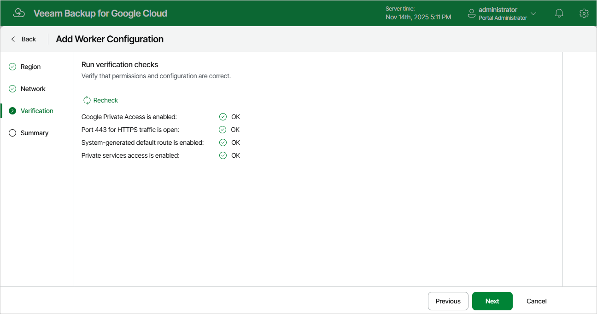

# Step 4. Check Required Prerequisites

At the Verification step of the wizard, Veeam Backup for Google Cloud will verify whether all the necessary prerequisites required to deploy worker instances based on the new worker configuration are met. For more information on the prerequisites, see [Specifying Network Settings](worker_network_settings.md).

