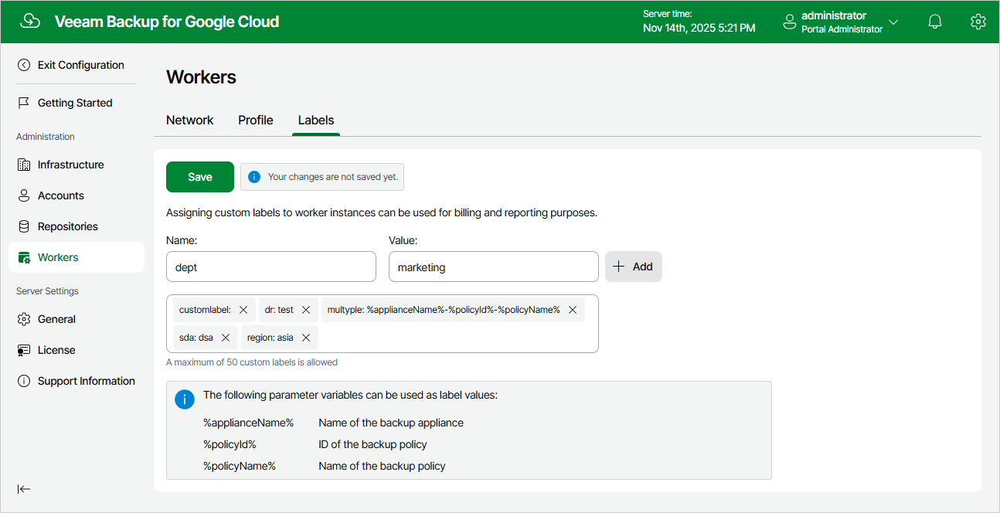

In this article

Veeam Backup for Google Cloud allows you to assign labels to worker instances deployed during backup and restore operations. You can then use these labels to track worker instances in Google Cloud for billing and reporting purposes.

To add a new label, do the following:

1. Switch to the Configuration page.
2. Navigate to Workers > Labels.
3. Use the Name and Value fields to specify a name and a value for the label, and then click Add. Note that you cannot add more than 50 labels.

1. Click Save.

|  |
| --- |
| Note |
| The veeamvbid label is assigned to all newly deployed worker instances automatically and is reserved by Veeam Backup for Google Cloud for internal purposes. |

Page updated 11/14/2025

Page content applies to build 7.0.0.47
