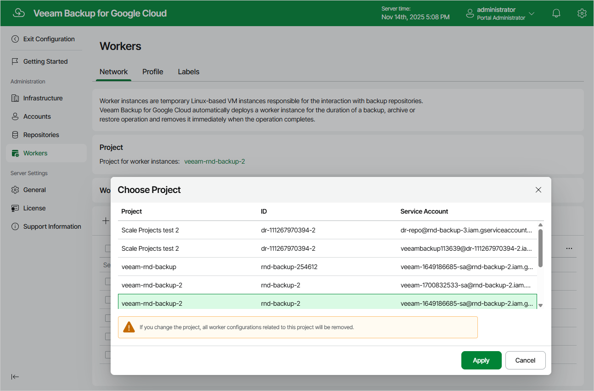

# Specifying Project for Worker Instances

To specify a project in which worker instances will be created, do the following:

1. Switch to the Configuration page.
2. Navigate to Workers > Network.
3. Click the link in the Project section.
4. In the Choose Project window, select the project associated with a service account whose permissions will be used to deploy worker instances. Then, click Apply.

Note that Veeam Backup for Google Cloud does not automatically check whether the service account has all the permissions required to deploy worker instances. That is why you must select the project carefully.

|  |
| --- |
| IMPORTANT |
| It is recommended that you do not use a production project for worker instances. Production projects are not suitable for worker instances, since they could use too many network and storage resources when added to workloads in large environments, and thus could trigger the [Google Cloud quota limits](https://cloud.google.com/compute/resource-usage#disk_quota). |

